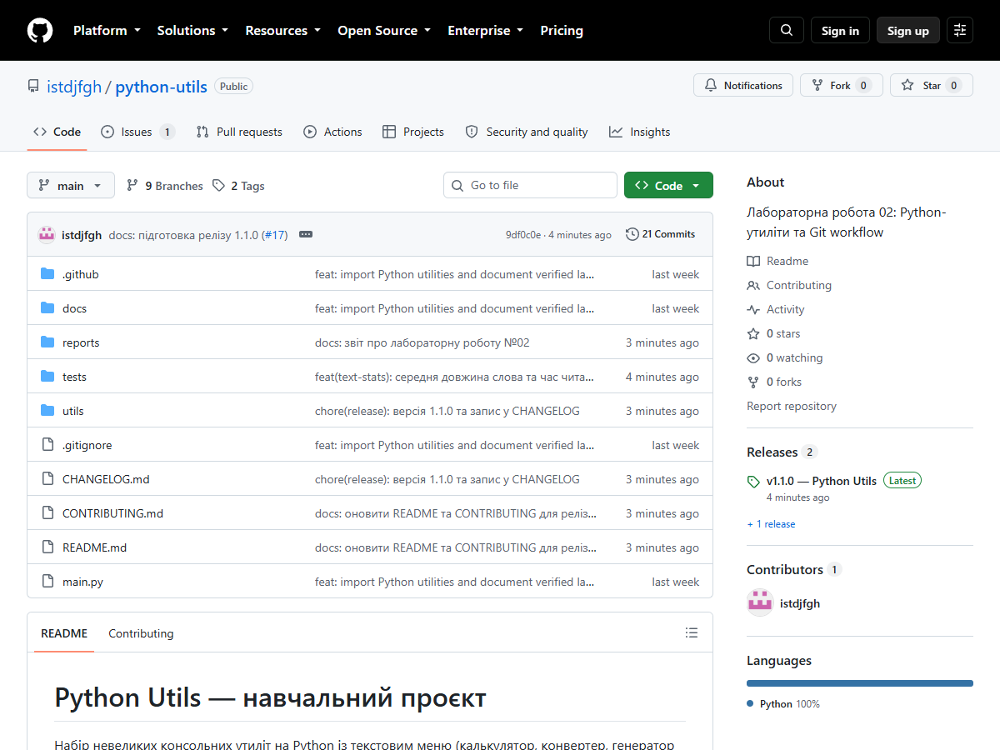
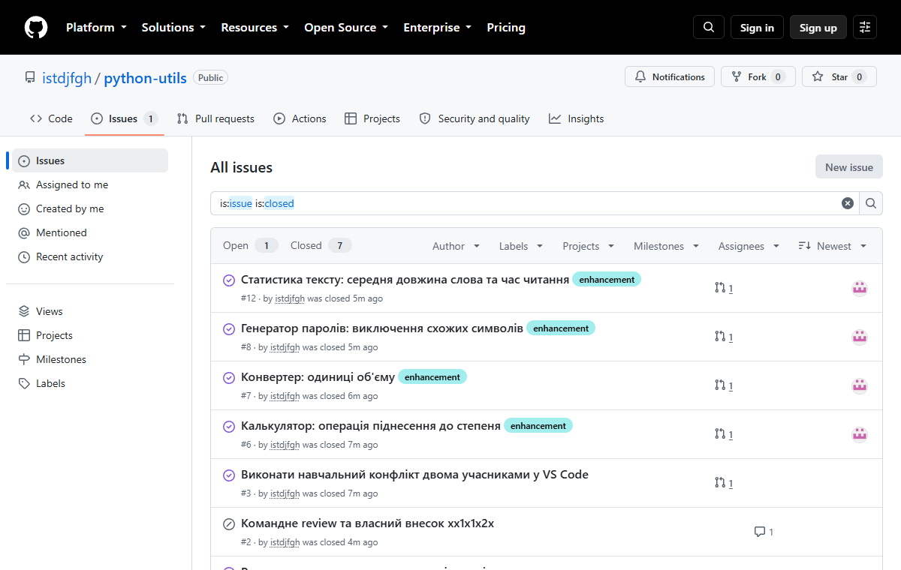
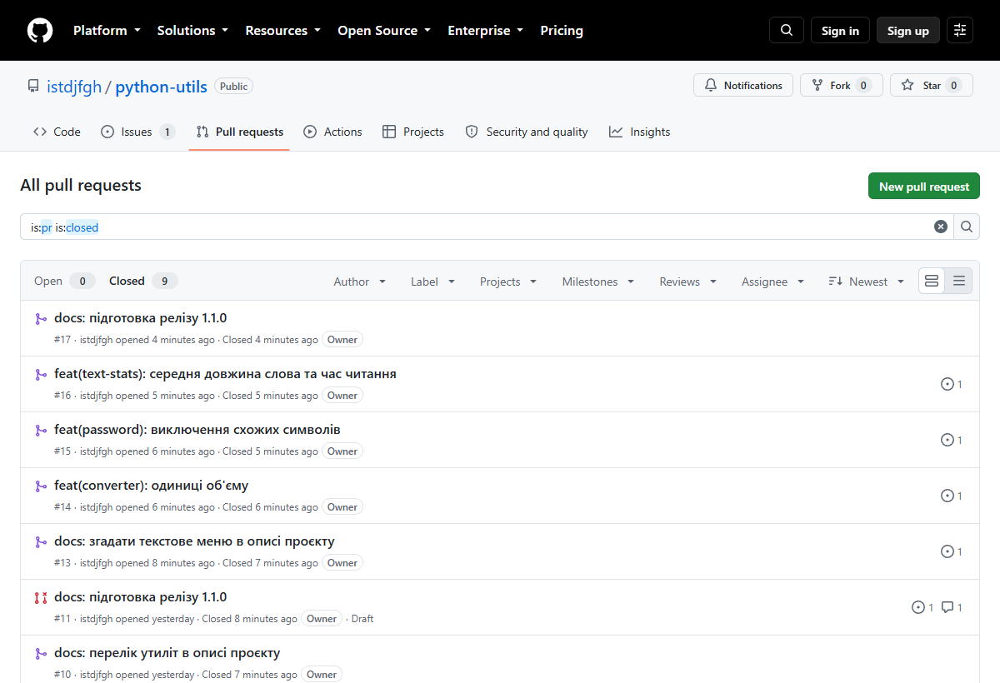
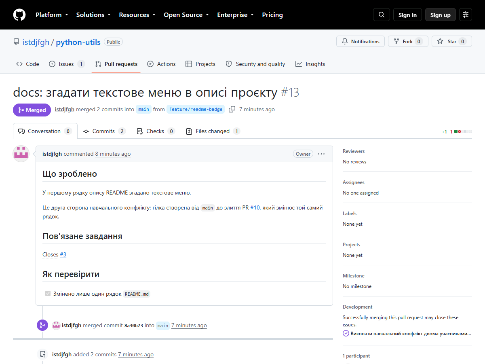
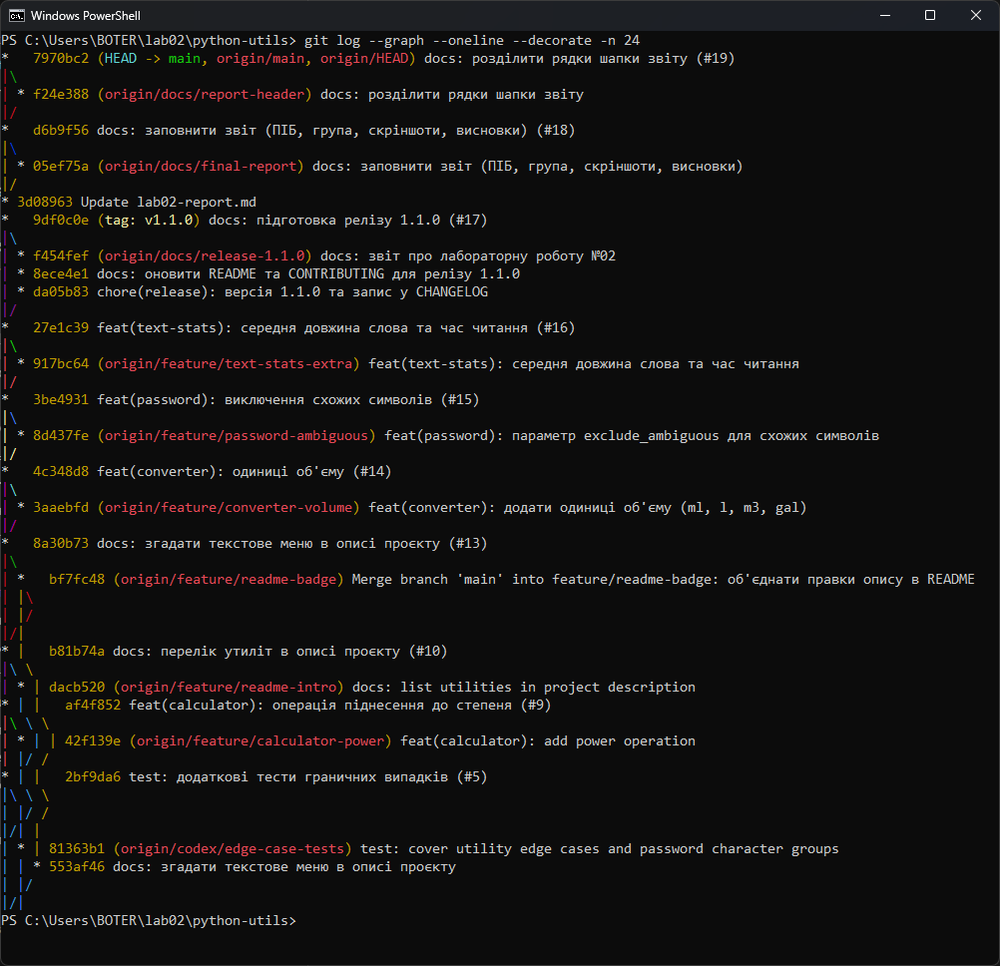
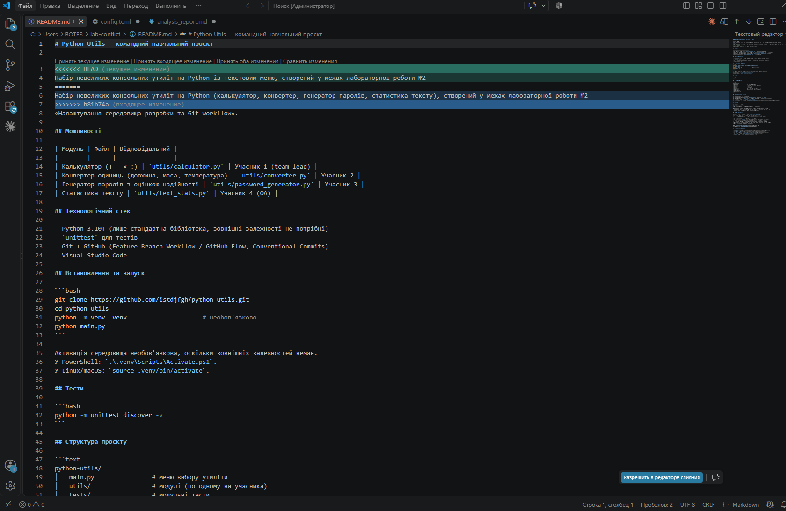
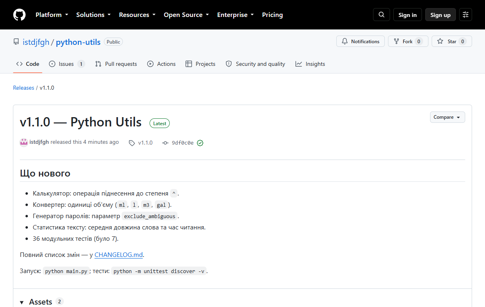
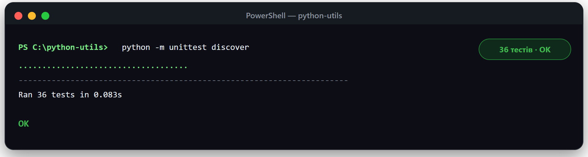

# Лабораторна робота №02 — звіт

**Тема:** Налаштування середовища розробки та Git workflow.  
**ПІБ:** Пламетюк Ілля Олександрович  
**Група:** ІПЗ-22  
**Дата:** 29 вересня 2026 року  
**Репозиторій:** https://github.com/istdjfgh/python-utils  
**Акаунт GitHub:** `istdjfgh`  
**Формат виконання:** індивідуально.

## Мета

Опанувати базові операції Git, організацію гілок і Pull Request,
вирішення конфліктів та підготовку релізу.

## Середовище

- Git, Python 3.10+, Visual Studio Code.
- Проєкт: чотири консольні утиліти (`calculator`, `converter`, `password_generator`,
  `text_stats`) із меню в `main.py`; лише стандартна бібліотека, тести на `unittest`.

## Виконана робота

Задачі оформлювались як Issues, кожна зміна — окрема гілка від актуальної `main`
і окремий Pull Request із `Closes #N`. Злиття виконувалось звичайним merge-комітом,
щоб у графі історії були видні гілки.

| PR | Гілка | Що зроблено | Issue |
|----|-------|-------------|-------|
| [#5](https://github.com/istdjfgh/python-utils/pull/5) | `codex/edge-case-tests` | 13 тестів граничних випадків | #1 |
| [#9](https://github.com/istdjfgh/python-utils/pull/9) | `feature/calculator-power` | операція `^` у калькуляторі | #6 |
| [#10](https://github.com/istdjfgh/python-utils/pull/10) | `feature/readme-intro` | перелік утиліт в описі README (перша сторона конфлікту) | #3 |
| [#13](https://github.com/istdjfgh/python-utils/pull/13) | `feature/readme-badge` | згадка текстового меню в тому самому рядку (друга сторона, конфлікт вирішено) | #3 |
| [#14](https://github.com/istdjfgh/python-utils/pull/14) | `feature/converter-volume` | одиниці об'єму в конвертері | #7 |
| [#15](https://github.com/istdjfgh/python-utils/pull/15) | `feature/password-ambiguous` | виключення схожих символів у паролях | #8 |
| [#16](https://github.com/istdjfgh/python-utils/pull/16) | `feature/text-stats-extra` | середня довжина слова та час читання | #12 |

Кількість тестів на `main`: 7 (початкові) → 20 (PR #5) → 22 (#9) → 26 (#14) → 30 (#15) → 36 (#16).



*Рисунок 1 — Головна сторінка репозиторію python-utils (21 коміт, реліз v1.1.0)*



*Рисунок 2 — Закриті Issues: кожне завдання оформлено окремим Issue*



*Рисунок 3 — Закриті Pull Request'и (№5–№17)*

## Навчальний конфлікт

Дві гілки створено від однієї версії `main`; обидві змінюють перший рядок опису в `README.md`
(PR #10 і PR #13). Після злиття PR #10 у PR #13 виник конфлікт злиття.
Вирішення: `git merge origin/main` у гілці `feature/readme-badge`, вручну прибрано маркери
`<<<<<<<` / `=======` / `>>>>>>>`, залишено рядок, що об'єднує обидві правки,
запущено тести, створено merge-коміт `bf7fc48` та відправлено гілку; після цього PR #13 злито.



*Рисунок 4 — Pull Request №13: друга сторона навчального конфлікту, злитий після вирішення*



*Рисунок 5 — Історія гілок (`git log --graph`): merge-коміт `bf7fc48` із вирішенням конфлікту*



*Рисунок 6 — Конфлікт злиття в `README.md` у VS Code (маркери Current / Incoming Change)*

## Реліз

Версію `1.1.0` описано в [CHANGELOG.md](../CHANGELOG.md); реліз
[v1.1.0](https://github.com/istdjfgh/python-utils/releases/tag/v1.1.0) створено з `main`
після злиття всіх функціональних змін. Попередній реліз — v1.0.0.



*Рисунок 7 — Реліз v1.1.0 на GitHub*

## Перевірка

```powershell
git clone https://github.com/istdjfgh/python-utils.git
cd python-utils
python -m unittest discover -v      # 36 тестів, усі проходять
python main.py
```



*Рисунок 8 — Результат `python -m unittest discover`: 36 тестів, усі проходять*

## Висновки

У ході лабораторної роботи було налаштовано середовище розробки (Git, Python, VS Code) та опрацьовано Feature Branch Workflow: кожне завдання оформлювалося як окремий Issue, окрема гілка та Pull Request із посиланням Closes #N.

Створено 9 Pull Request'ів (8 злито), функціональні зміни покрито 36 модульними тестами. Під час навчального конфлікту дві гілки змінили один і той самий рядок README; після злиття першої з них у другій виник конфлікт, який було вирішено вручну: git merge origin/main, вибір потрібних рядків, запуск тестів. Підготовлено реліз v1.1.0 з описом змін у CHANGELOG.

Найскладнішим було підготувати й узгодити всі гілки та Pull Request'и; на це пішло 3 дні з використанням ШІ.
